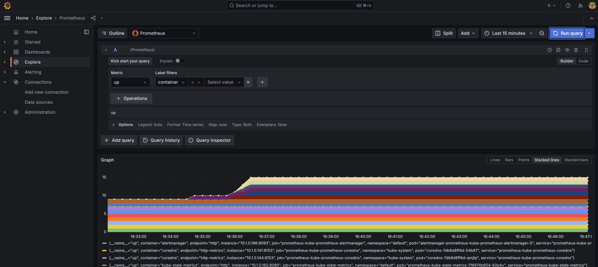

# Banking Services System with Microservices Architecture

This project is a microservices-based banking services system. It includes several services such as accounts, cards, loans, and more, with observability and security tools like Grafana, Loki, Prometheus, Tempo, and Keycloak.

## Services

- `accounts`: Manages bank account information
- `cards`: Manages credit card details
- `loans`: Handles loan services
- `gatewayserver`: API gateway for microservices
- `eurekaserver`: Service discovery using Netflix Eureka
- `configserver`: Centralized configuration management
- `message`: Messaging service
- `helm`: Helm charts for Kubernetes deployments
- `kafka`: Event streaming using Apache Kafka
- `keycloak`: Identity and access management
- `grafana`: Dashboard for monitoring and observability
- `grafana-loki`: Log aggregation
- `grafana-tempo`: Tracing system
- `prometheus`: Monitoring and alerting toolkit

## Setup

### Docker Compose

1. Clone the repository:
   ```bash
   git clone https://github.com/jungchechang/microservices.git
2. Navigate to the project directory:
   ```bash
   cd microservices/docker-compose/default
3. Start the services using Docker Compose:
   ```bash
   docker-compose up
### Helm
The project also supports deployment with Helm charts. Make sure you have a Kubernetes cluster ready.
#### Helm Installation Order
1. Install Keycloak:
   ```bash
   helm install keycloak helm/keycloak
2. Install Kafka:
   ```bash
   helm install kafka helm/kafka
3. Install Prometheus:
   ```bash
   helm install prometheus helm/kube-prometheus
4. Install Loki:
   ```bash
   helm install loki helm/grafana-loki
5. Install Tempo:
   ```bash
   helm install tempo helm/grafana-tempo
6. Install Grafana:
   ```bash
   helm install grafana helm/grafana
7. Install main services:
   ```bash
   helm install happybank helm/environments/prod-env

## Screenshot
### Monitoring using Grafana

### Loki & Tempo


### Prometheus


